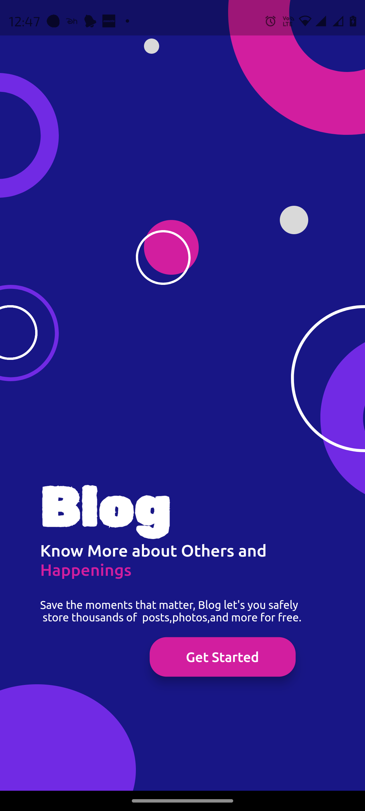
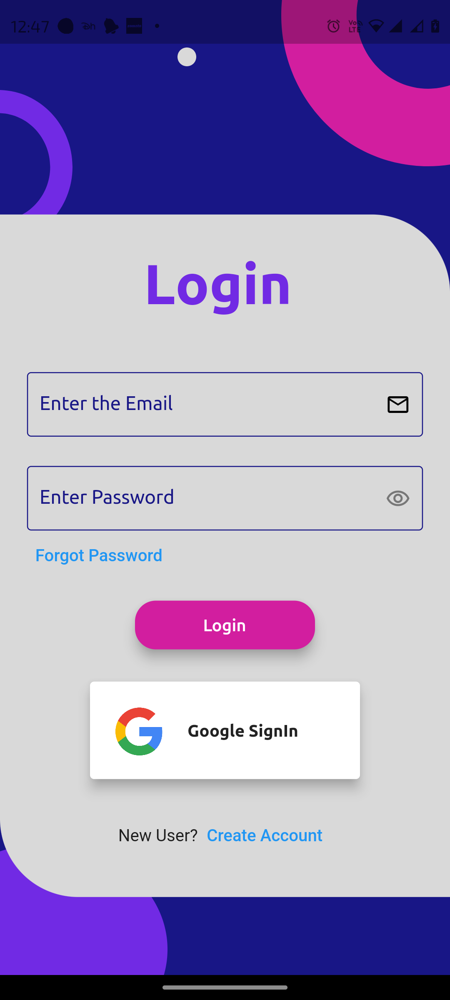
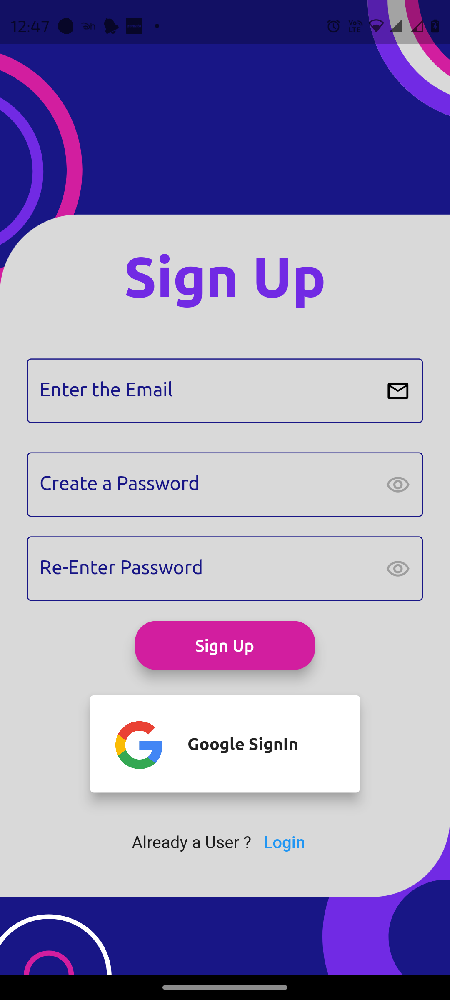

# Blog-App

# Get Started 
 Users can easily access our platform by signing in or signing up using their email and password, or through their Google account. Once logged in, they can create and customize their profile, allowing them to showcase their interests and 
 preferences. Our platform also enables users to post and edit blogs, providing them with a space to share their thoughts and experiences. Additionally, users can explore a wide range of blogs from various categories, allowing them to 
 discover new and exciting content. Furthermore, our platform offers the option to like and comment on blogs, fostering engagement and interaction within the community. With the ability to delete blogs, users have full control over their #content, ensuring a seamless and personalized experience.
 # start page

# Login page

# sign up Page
